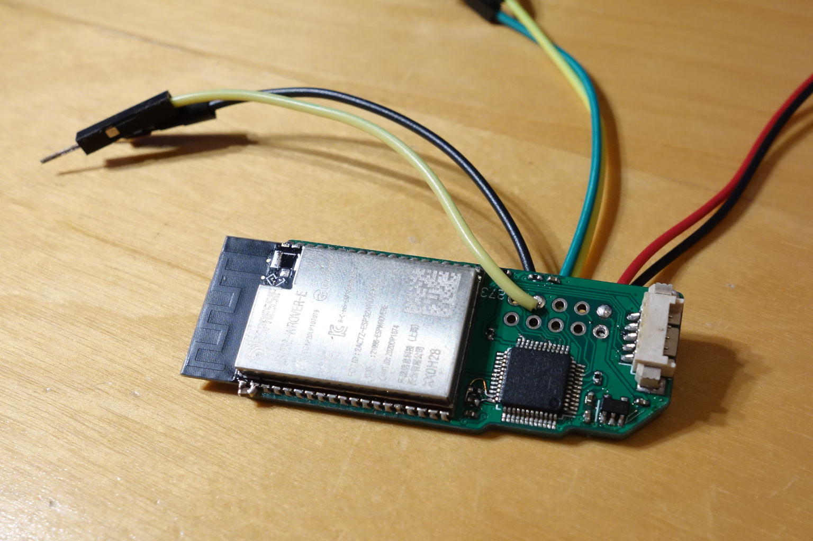

# Chiral Sphere

LED lamp based on a chiral spherical tiling consisting of 20 triangles and
12 Pentagons where the edge-length ratio triangle:pentagon is 2:1.

[Video](https://mastodon.social/@brainsmoke/111589632039788005)

# Materials

* 2x 5m WS2812 LED strips, 60 LEDs/m spacing, 10mm wide, cut into 30 strips of 17
* +/- 11 meters flexible diffuser, 12mm wide
* [custom joint PCBs [kicad]](yjoint) [[svg]](pcb/yjoint/penta_joint.svg)
* [LED driver board](https://github.com/brainsmoke/esp32leddriver/tree/master/pcb/edgedriver_slim_v1)
* thin wire (for connecting the data lines)
* 2x ~30cm thick wire (to handle high currents near the power connector)
* 3mm plywood, 4x 600x400mm
* white paint
* wood glue

# Maths

* [Formula for the relation between corner arc and edge-length for regular N-gons on the unit sphere](https://github.com/brainsmoke/geometry/blob/main/spherical/ngonmath.png)
* [Calculation of the corner arc for this spherical tiling](https://github.com/brainsmoke/geometry/blob/main/spherical/2tri1penta.scad#L8-L34)
* [LED Locations & normals](https://github.com/brainsmoke/geometry/blob/main/scripts/led_locations.py)

# Cutting

Based on output from [one of my scripts](https://github.com/brainsmoke/geometry/blob/main/scripts/tube.py), but
with the outer panels removed so that the tubes become U-profiles and the sides modified so that they trace
a perfect sphere.

[Laser cut shapes](cut/led.svg) (with some spares; apply appropriate kerf width compensation before cutting)

# Wiring

All strips are positioned such that data-in is above data-out, with one pentagon chosen
as top.  The strips are connected as five point-symmetrical led strips with 102 LEDs each
according to [this OpenSCAD model](doc/wiring.scad).

# LED Driver

[PCB](https://github.com/brainsmoke/esp32leddriver/tree/master/pcb/edgedriver_slim_v1)

# Software

* [Driver software repo](https://github.com/brainsmoke/esp32leddriver)
* [STM32 Firmware: strip5.bin](https://github.com/brainsmoke/esp32leddriver/tree/master/firmware/stm32/m02812/src)
* [LED positions](https://github.com/brainsmoke/esp32leddriver/blob/master/firmware/esp32/models/chiral_tiling/leds.json)
* [conf/hardware.json](https://github.com/brainsmoke/esp32leddriver/blob/master/firmware/esp32/conf/chiral_tiling/hardware.json)

# More pictures

Add extra capacity to the strip which needs to handle the most Amps.

